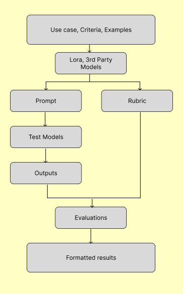
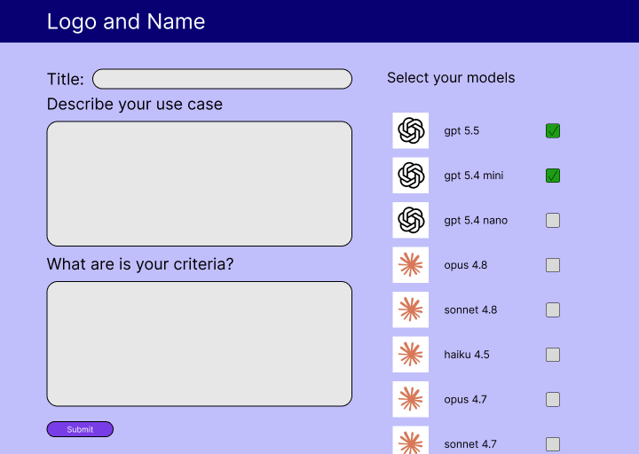
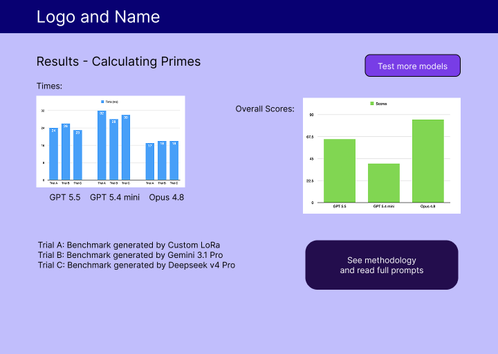

# Custom AI Evaluator
* Creates custom benchmark tests and rubrics to assess various AI models against each other on specific criteria and use cases. 
* Uses LoRa to create custom benchmarks and automatically runs tests. 
* Stores results and methodology to compare models over time.

### LoRa training data structure:
**Data collected by agent:**
```json
{
    "doi": "",
    "description": "",
    "criteria": "",
    "prompt": "",
    "rubric": ""
  }
  ```
**Format of training data:**
Input:
```
Create a benchmark test based on the following use case and criteria:
Use Case: {description}
Criteria: {criteria}
```
Output:
```
{prompt}<>{rubric}
```

### Data flowchart:


### Frontend mockkups:
**Entry page:**  


**Results page:**  
